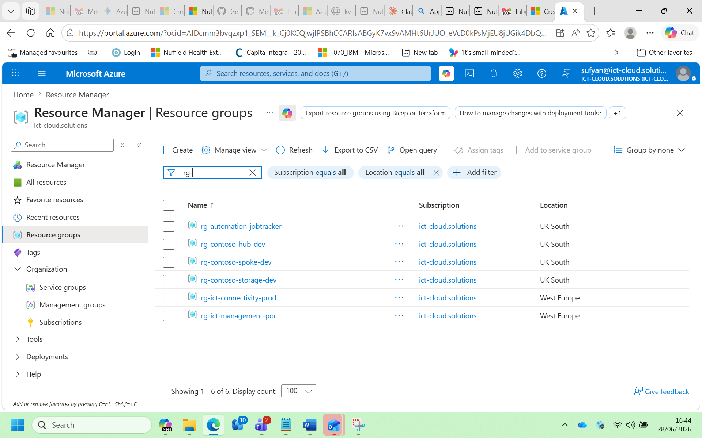
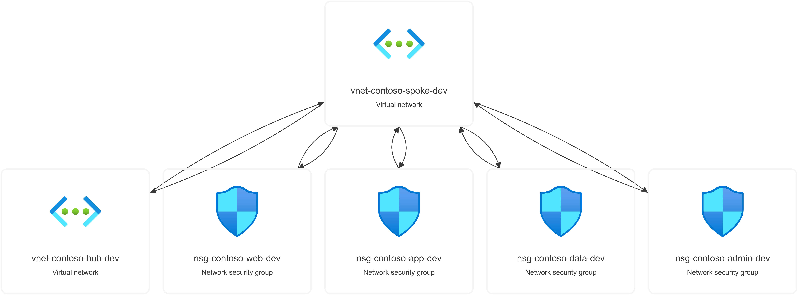
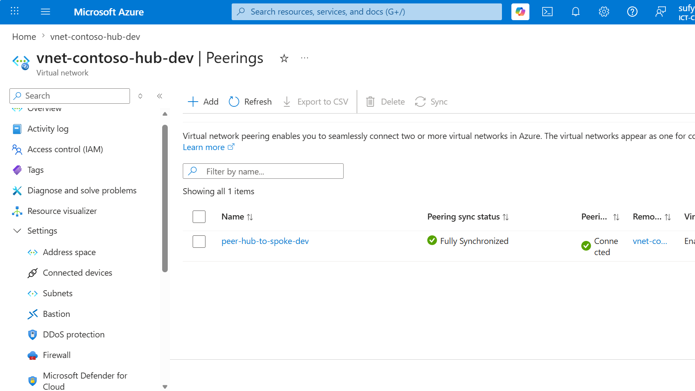
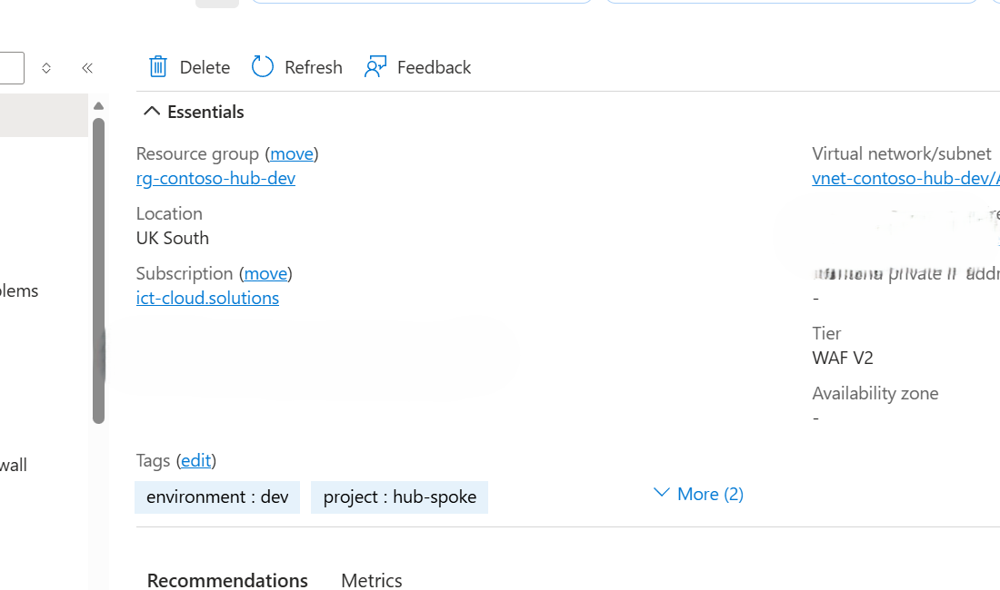
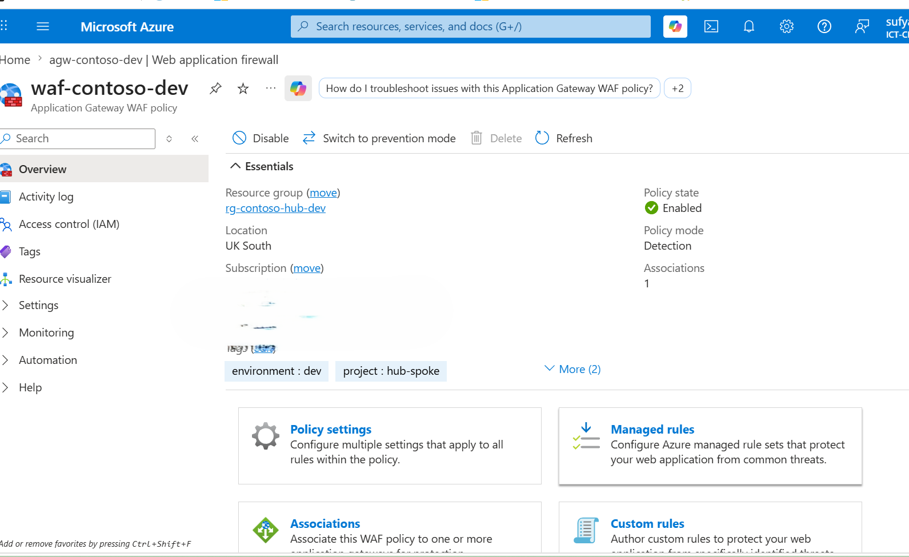
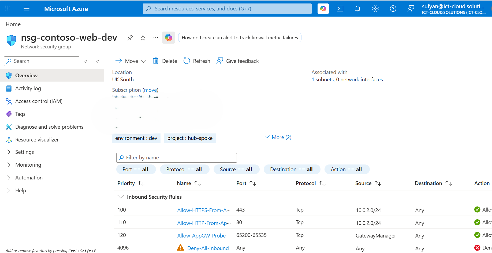
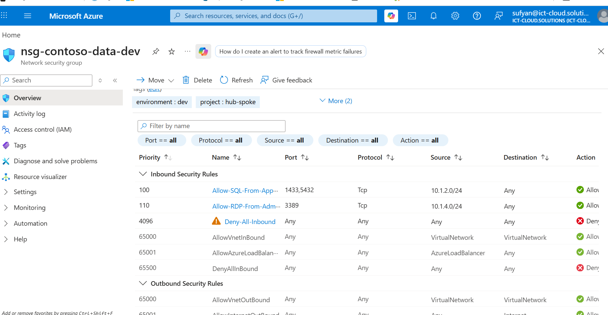
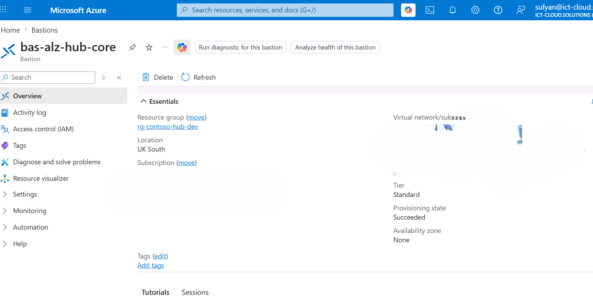
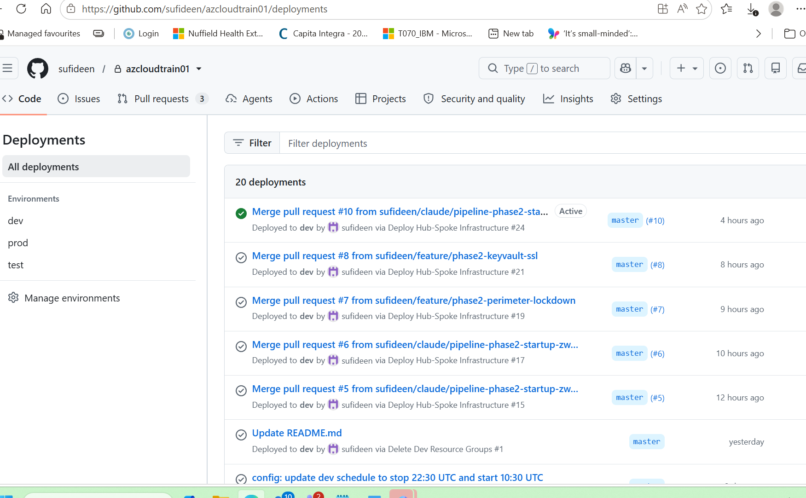
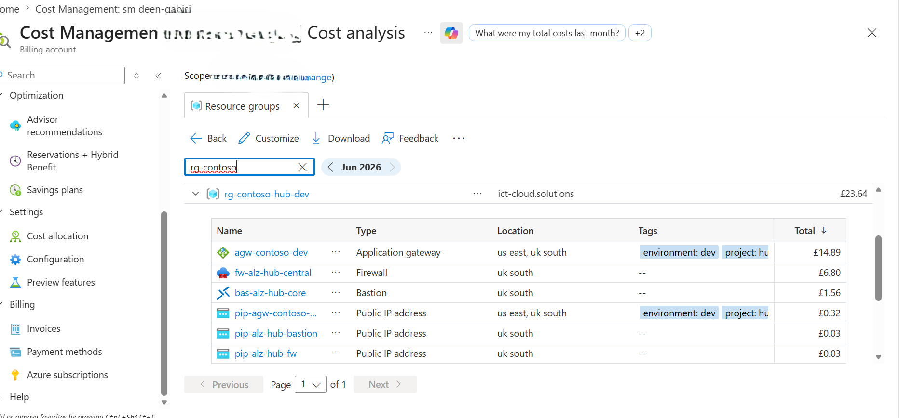

# Hub-and-Spoke Network Architecture

## Project Showcase

Screenshots taken from the live Azure environment before teardown.

### 1. All Resource Groups (9 total across dev / test / prod)


### 2. Hub Resource Group — prod


### 3. Spoke Resource Group — prod


### 4. Network Topology (hub-spoke peering)


### 5. VNet Peerings


### 6. App Gateway Overview (WAF v2)


### 7. WAF Policy (OWASP 3.2, Prevention mode)


### 8. NSG Rules — nsg-web


### 9. NSG Rules — nsg-data


### 10. Azure Bastion


### 11. CI/CD Pipeline — full run (Validate → Dev → Test → Prod)


### 12. Prod Approval Gate


### 13. Cost Analysis by Resource Group


---

## Overview

```
                         Internet
                            │
                   ┌────────▼────────┐
                   │  App Gateway    │  WAF v2 (OWASP 3.2)
                   │  (Public IP)    │  Prevention / Detection
                   └────────┬────────┘
                            │
              ┌─────────────▼──────────────┐
              │       HUB VNet             │  10.0.0.0/16
              │  ┌──────────────────────┐  │
              │  │ AppGatewaySubnet     │  │  10.0.2.0/24
              │  │ AzureFirewallSubnet  │  │  10.0.1.0/26
              │  │ AzureBastionSubnet   │  │  10.0.3.0/26
              │  │ GatewaySubnet        │  │  10.0.0.0/27
              │  └──────────────────────┘  │
              └──────────┬─────────────────┘
                         │  VNet Peering (bidirectional)
              ┌──────────▼─────────────────┐
              │     SPOKE VNet (per env)   │  dev=10.1/16  test=10.2/16  prod=10.3/16
              │  ┌────────────────────┐    │
              │  │ WebSubnet    .1/24 │◄───┼── NSG: Allow 80/443 from AppGW only
              │  │ AppSubnet    .2/24 │◄───┼── NSG: Allow from WebSubnet only
              │  │ DataSubnet   .3/24 │◄───┼── NSG: Allow SQL/PG from App; RDP from Admin
              │  │ AdminSubnet  .4/24 │◄───┼── NSG: Allow RDP/SSH from Bastion only
              │  └────────────────────┘    │
              └────────────────────────────┘
```

## Resource Groups

| Resource Group | Contents |
|---|---|
| `rg-contoso-hub-<env>` | Hub VNet, App Gateway, WAF Policy, Public IP |
| `rg-contoso-spoke-<env>` | Spoke VNet, NSGs (Web/App/Data/Admin) |
| `rg-contoso-storage-<env>` | Storage Account (Bicep artifacts + app data) |

## Subnet Design

### Hub (10.0.0.0/16)
| Subnet | CIDR | Purpose |
|---|---|---|
| GatewaySubnet | 10.0.0.0/27 | VPN / ExpressRoute gateway |
| AzureFirewallSubnet | 10.0.1.0/26 | Azure Firewall (future) |
| AppGatewaySubnet | 10.0.2.0/24 | App Gateway WAF v2 |
| AzureBastionSubnet | 10.0.3.0/26 | Azure Bastion (jump host) |

### Spoke per environment
| Subnet | Dev CIDR | Test CIDR | Prod CIDR | NSG |
|---|---|---|---|---|
| WebSubnet | 10.1.1.0/24 | 10.2.1.0/24 | 10.3.1.0/24 | nsg-web |
| AppSubnet | 10.1.2.0/24 | 10.2.2.0/24 | 10.3.2.0/24 | nsg-app |
| DataSubnet | 10.1.3.0/24 | 10.2.3.0/24 | 10.3.3.0/24 | nsg-data |
| AdminSubnet | 10.1.4.0/24 | 10.2.4.0/24 | 10.3.4.0/24 | nsg-admin |

## NSG Rules Summary

### nsg-web
| Priority | Rule | Port | Source |
|---|---|---|---|
| 100 | Allow HTTPS | 443 | AppGatewaySubnet |
| 110 | Allow HTTP | 80 | AppGatewaySubnet |
| 120 | Allow AppGW Probe | 65200-65535 | GatewayManager |
| 4096 | Deny All | * | * |

### nsg-app
| Priority | Rule | Ports | Source |
|---|---|---|---|
| 100 | Allow from Web | 80,443,8080,8443 | WebSubnet |
| 4096 | Deny All | * | * |

### nsg-data
| Priority | Rule | Port | Source |
|---|---|---|---|
| 100 | Allow SQL/PostgreSQL | 1433, 5432 | AppSubnet |
| 110 | Allow RDP | 3389 | AdminSubnet |
| 4096 | Deny All | * | * |

### nsg-admin
| Priority | Rule | Port | Source |
|---|---|---|---|
| 100 | Allow RDP | 3389 | BastionSubnet |
| 110 | Allow SSH | 22 | BastionSubnet |
| 4096 | Deny All | * | * |

## CI/CD Pipeline

```
PR / push to main
       │
  ┌────▼────┐     bicep build + what-if
  │ Validate │──────────────────────────►  fail fast, no Azure cost
  └────┬────┘
       │ (merge to main)
  ┌────▼────┐
  │ Dev     │──── auto deploy
  └────┬────┘
       │ (manual approval gate)
  ┌────▼────┐
  │ Test    │──── deploy
  └────┬────┘
       │ (manual approval gate)
  ┌────▼────┐
  │ Prod    │──── deploy
  └─────────┘
```

## Prerequisites for CI/CD

1. **Azure OIDC App Registration** — federated credential pointing to your GitHub repo
2. **GitHub Secrets** on the repo:
   - `AZURE_CLIENT_ID`
   - `AZURE_TENANT_ID`
   - `AZURE_SUBSCRIPTION_ID`
3. **GitHub Environments** named `dev`, `test`, `prod` — add required reviewers on `test` and `prod`
